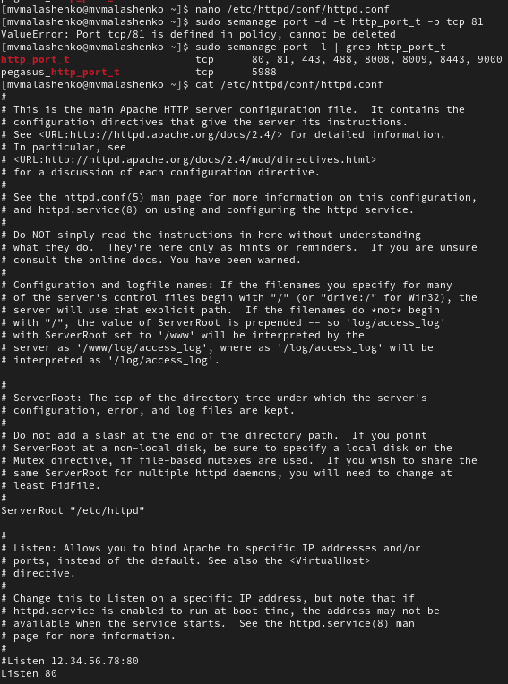

---
## Front matter
lang: ru-RU
title: Защита лабораторной работы №6
subtitle: Информационная безопасность
author:
  - Мальков Р. С.
institute:
  - Российский университет дружбы народов, Москва, Россия
date: 2024

## i18n babel
babel-lang: russian
babel-otherlangs: english

## Fonts
mainfont: Times New Roman
romanfont: Times New Roman
sansfont: Times New Roman
monofont: Times New Roman
mainfontoptions: Ligatures=TeX
romanfontoptions: Ligatures=TeX
sansfontoptions: Ligatures=TeX,Scale=MatchLowercase
monofontoptions: Scale=MatchLowercase,Scale=0.9

## Formatting pdf
toc: false
toc-title: Содержание
slide_level: 2
aspectratio: 169
section-titles: true
theme: metropolis
header-includes:
  - \metroset{progressbar=frametitle,sectionpage=progressbar,numbering=fraction}
  - '\makeatletter'
  - '\beamer@ignorenonframefalse'
  - '\makeatother'
---

## Цель лабораторной работы

- Развить навыки администрирования ОС Linux. Получить первое практическое знакомство с технологией SELinux1. Проверить работу SELinx на практике совместно с веб-сервером Apache

## Теоретическая справка (1)

1. **SELinux (Security-Enhanced Linux)** обеспечивает усиление защиты путем внесения изменений как на уровне ядра, так и на уровне пространства пользователя,
что превращает ее в действительно «непробиваемую» операционную систему

## Теоретическая справка (1)

*SELinux имеет три основных режим работы:*

- Enforcing: режим по умолчанию. При выборе этого режима все действия, которые каким-то образом нарушают текущую политику безопасности, будут блокироваться, а попытка нарушения будет зафиксирована в журнале.

- Permissive: в случае использования этого режима, информация о всех действиях, которые нарушают текущую политику безопасности, будут зафиксированы в журнале, но сами действия не будут заблокированы.

- Disabled: полное отключение системы принудительного контроля доступа.

## Теоретическая справка (2)

2. **Apache** — это свободное программное обеспечение, с помощью которого можно создать веб-сервер. Данный продукт возник как доработанная версия другого HTTP-клиента от национального центра суперкомпьютерных приложений
(NCSA)

## Теоретическая справка (2)

*Для чего нужен Apache сервер:*

- чтобы открывать динамические PHP-страницы,

- для распределения поступающей на сервер нагрузки,

- для обеспечения отказоустойчивости сервера,

- чтобы потренироваться в настройке сервера и запуске PHP-скриптов.

# Ход выполнения лабораторной работы

## Выполнение лабораторной работы

Убедились, что SELinux работает в режиме enforcing политики targeted

{ #fig:001 width=70% height=70% }

## Выполнение лабораторной работы

Обратились с помощью браузера к веб-серверу, запущенному на  компьютере, и убедились, что последний работает

{ #fig:002 width=70% height=70% }

## Выполнение лабораторной работы

Определили контекст безопасности веб-сервера Apache

{ #fig:003 width=70% height=70% }

## Выполнение лабораторной работы

Посмотрели текущее состояние переключателей, многие из переключателей находятся в положении “off”

{ #fig:004 width=70% height=70% }

## Выполнение лабораторной работы

Посмотрели статистику по политике. Множество пользователей - 8, ролей - 14, типов 5100

{ #fig:005 width=70% height=70% }

## Выполнение лабораторной работы

Посмотрели файлы и поддиректории, находящиеся в директории /var/www. Определили, что в данной директории файлов нет. Только владелец/суперпользователь может создавать файлы в директории /var/www/html

{ #fig:006 width=70% height=70% }

## Выполнение лабораторной работы

От имени суперпользователя создали html-файл. Контекст созданного файла - httpd_sys_content_t

{ #fig:007 width=70% height=70% }

## Выполнение лабораторной работы

Обратились к файлу через веб-сервер, введя в браузере адрес “http://127.0.0.1/test.html”. Файл был успешно отображен

{ #fig:008 width=70% height=70% }

## Выполнение лабораторной работы

Изучив справку httpd_selinux, выяснили, какие контексты определены для файлов httpd.

Контекст моего файла - httpd_sys_content_t (в таком случае содержимое должно быть доступно для всех скриптов httpd и для самого демона). Изменили контекст файла на samba_share_t

{ #fig:009 width=70% height=70% }

## Выполнение лабораторной работы

Попробовали еще раз получить доступ к файлу через веб-сервер, введя в браузере адрес “http://127.0.0.1/test.html” и получили сообщение об ошибке (т.к. кустановленному ранее контексту процесс httpd не имеет доступа)

{ #fig:010 width=70% height=70% }

## Выполнение лабораторной работы

Убедились, что читать данный файл может любой пользователь. Просмотрели системный лог-файл веб-сервера Apache, отображающий ошибки

{ #fig:011 width=70% height=70% }

## Выполнение лабораторной работы

В файле /etc/httpd/conf/httpd.conf заменили строчку “Listen 80” на “Listen 81”, чтобы установить веб-сервер Apache на прослушивание TCP-порта 81

{ #fig:012 width=70% height=70% }

## Выполнение лабораторной работы

Перезапускаем веб-сервер Apache и анализируем лог-файлы командой “tail -nl /var/log/messages”

{ #fig:013 width=70% height=70% }

## Выполнение лабораторной работы

Просмотрели файлы “var/log/http/error_log”, “/var/log/http/access_log” и "/var/log/audit/audit.log” и выяснили, что запись появилась в последнем файле

{ #fig:014 width=70% height=70% }

## Выполнение лабораторной работы

Проверили список портов командой, убедились, что порт 81 есть в списке и запускаем веб-сервер Apache снова

{ #fig:015 width=70% height=70% }

## Выполнение лабораторной работы

Вернули контекст “httpd_sys_cоntent_t” файлу “/var/www/html/test.html” и попробовали получить доступ к файлу через веб-сервер, введя адрес “http://127.0.0.1:81/test.html”, увидели содежимое файла - слово “test”

{ #fig:017 width=70% height=70% }

## Выполнение лабораторной работы

Исправили обратно конфигурационный файл apache, вернув “Listen 80”. Попытались удалить привязку http_port к 81 порту, но этот порт определен на уровне политики, поэтому его нельзя удалить

{ #fig:018 width=70% height=70% }

## Выполнение лабораторной работы

Удалили файл “/var/www/html/test.html”

{ #fig:019 width=70% height=70% }

# Вывод

В ходе выполнения данной лабораторной работы были развиты навыки администрирования ОС Linux, получено первое практическое знакомство с технологией SELinux и проверена работа SELinux на практике совместно с веб-сервером
Apache.

# Список литературы. Библиография

[0] Методические материалы курса

[1] SELinux: https://habr.com/ru/companies/kingservers/articles/209644/

[2] Apache: https://2domains.ru/support/vps-i-servery/shto-takoye-apache